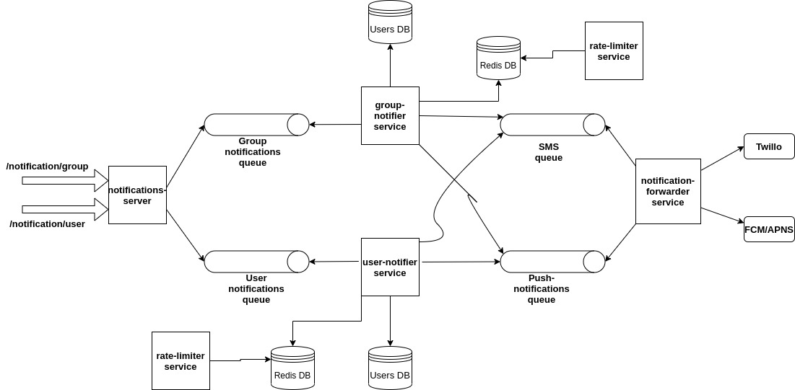
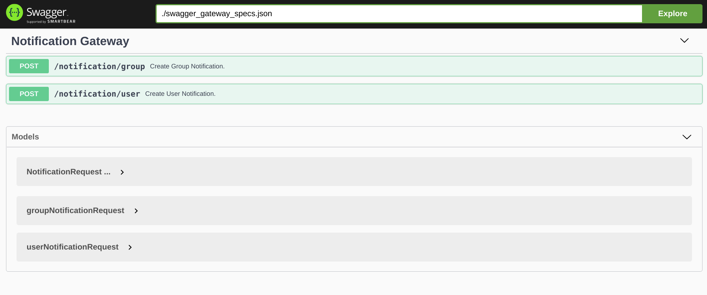

# Swvl Backend Challenge
In SWVL, we are communicating with our customers via notifications. we are sending
Promo codes to customers via SMS. Also, We are sending to our riders notifications
during their ride like “Your drop-off station is coming”. Customer view all push
notifications in the App. Each customer receives a notification with a preferred
language.

## Specifications:
- Some Notification will be sent by SMS.
- Some Notification will be sent via Push Notification to mobile.
- We have two types of notification
- Group notification which are send as a text notification to a group of users.
- The personalized notification which are send as a specific text notification to each
user.
- The number of requests of providers (SMS, Email) can handle per minute are
limited.

## Requirements:
- Design and implement the notification schema.
- Implement notification service which handles the database changes and sends
notifications for customers.
- Service should be run by docker-compose up.
- Document your APIs.
- Test your code using unit test.

# How to Build/Run:
1. Build the docker images of all services with `make build`.

2. Run all serices with `make run` or `docker-compose up`.

3. Run `make clean` to delete all iamges.
4. After running you may check the logs of any service using its conteiner name `docker logs -f notifications-forwarder`.
# Repo structure:
```
- common/  common util go module which is used across all servces
- notification-server(gateway_/  starting point of notification lifecycle
- user-notifier/
- group-notifier
- notifications-forwarder/ logs all the incoming events on console
- rate-limiter/ distributed sync locked rate limit counter
- docker-composeyml
- swagger_gateway_specs.json swagger specs for gateway API.
- Makefile makefile to take care of building/running the app, this is also available inside each service folder, so that frequently used commands can be mad part of automation.

```
# Solution Overview & Architecture



- notification-server(gateway) service: front facing gateway for for notifications, its responsible for validating the notification bodies and directing them as a event stream to their messaging queues for further processing.
- group-notifier service: this service is responsible following:
    - Gets the group users information from the users DB.
    - Get and update the sms rate/minute limit distributed counter.
    - Forwards the notificationto it's respective queue.
- user-notifier service
    - Gets the users personalized information from the users DB.
    - Get and update the sms rate/minute limit distributed counter.
    - Forwards the notificationto it's respective queue.
- rate-limiter
    - this on start sets the sms rate/minute limit in the redis DB.
    - after eery minute, this resets the limit to the provided limit number.
- notification-forwarder service
    - consumes the notifications from the `sms` and `push` topics.

## Functional Description
**Step 1:** POST Request is made to the `notification-service` for group notification `/notification/group` or user notification `/notification/user` to the notifications server, which then parses and validates the request object and pushes notification to the `group` or `user` kafka topic based on the NotificationType `type`.

**Step 2:** `group-notifier service` or `user-notifier service` then consumes messages/notifications from their respective kafka topics, recreates the notification by querying the respective DB to enhancing the user or group message with their meta, tokens, message templates and formating the final message.

**Step 3:** `group-notifier service` or `user-notifier service` then pushes the enhanced notification to the `sms` or `push` kafka topic based on the `sendVia` type.

**Step 4:** `notification-forwarder` then consumes the notifications from the `sms` and `push` topics, and can forward the notifications to the Twillo for SMS or Firebase Cloud Messaging (FCM) or Apple Push Notification service(APNS).

**Note:** For `notification-forwarder` logs all the consumed notifications to console.
**Note:** `group-notifier` and `user-notifier` services will block consuming the SMS type events/notifications if give rate per minutes has increased then given rate.
# API
`notification-service` exposes two endpoints for group and user notifications.
- `/notification/group`
body:
```
{
    "groupId": "1",
    "sendVia": "sms",
    "message": "Hello Swvl, avail 20 % off",
    "type":"group",
    "category":"promo",
    "tags":["newyYear", "winter", "exams"]
    createdAt:"2020-10-03T15:04:05.0000000Z" // accepts standard RFC 3339 format
}
```
- `/notification/user`
body:
```
{
    "userId": "1",
    "sendVia": "sms",
    "message": "Hello Swvl, avail 20 % off",
    "type":"user",
    "category":"promo",
    "tags":["newyYear", "winter", "exams"]
    createdAt:"2020-10-03T15:04:05.0000000Z" // accepts standard RFC 3339 format
}
```
Also swager specs are hosted on `localhost:8080` using Swagger UI.


# Fault Tolerance & High availability
- All the services can have multiple replication services, load balancers and serice disovery mechanism can select the next available gateway service in case of failure.
- In case of queue consuming services, we can run more consumers per group which will automatically start consuming, given some othe partion has become unhealthy and partion number matches the consumers.
# Scalability & Performance
- All the services are stateless and requires no such run time configurations whic may restart the service. Thats why in any container orchastration platform like kubernetes or docker swarm these ervices can be scaled up and scaled down with minimal cost.
- All the I/O operations are asynchronous across services, as this comes built-in with go so maximum performance is guranted.
# Security Considerations
- Incoming requests can be authenticated and authorized using `OUTH 2`. Using gateway pattern we can add a auth and authz layer at the front of our app.
- For communication happening between services, we can use mTLS via service mesh pattern. In service mesh pattern we will run a side car container with each service, which will take care authenticating the incoming message using mTLS. Using ervice mesh patter we don't have to do any change in our code of the service. But service mesh pattern might add very minimal latency across the notification lifecycle.